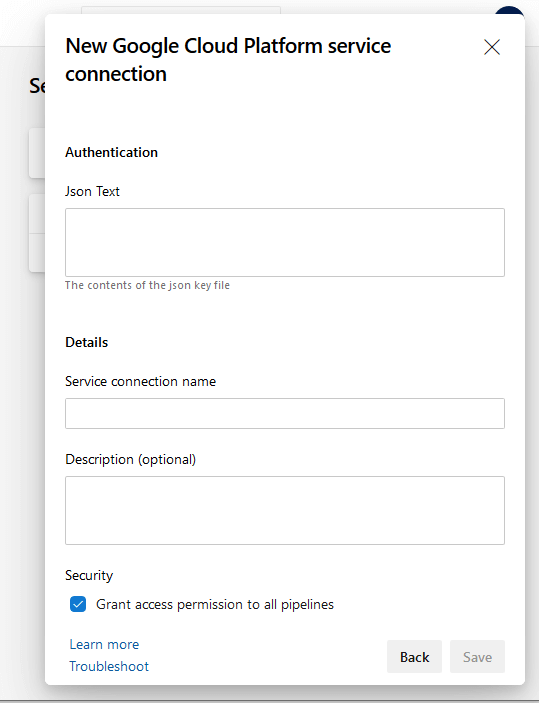

  

# Google Cloud Tools for Azure DevOps Pipelines

Google Cloud Platform (GCP) tasks for Azure DevOps Pipelines
_(work in progress)._

## Tasks

|||
|---|---|
|  | **[Google Cloud SDK tool installer](https://github.com/nexsolab/azure-devops-google-cloud-tools/tree/master/Tasks/GoogleCloudSdkTool)** Install gcloud CLI for use in all tasks or for custom commands. |
|  | **[Google Cloud Functions](https://github.com/nexsolab/azure-devops-google-cloud-tools/tree/master/Tasks/GoogleCloudFunctions)** Deploy code to functions or manage Cloud Functions:  Create/Update, Delete or Call functions. |
|  | **[Google Cloud PubSub](https://github.com/nexsolab/azure-devops-google-cloud-tools/tree/master/Tasks/GoogleCloudPubSub)** Manage PubSub topics, subscriptions and publish or get messages from topic. |
|  | **[Google Cloud Memorystore](https://github.com/nexsolab/azure-devops-google-cloud-tools/tree/master/Tasks/GoogleCloudMemorystore)** Create, delete, failover or upgrade Redis instances. |
|  | **[Manage DNS records](https://github.com/nexsolab/azure-devops-google-cloud-tools/tree/master/Tasks/GoogleCloudDNS)** Add, remove or get the value of the record sets for managed zones. |

### Next:
- **Deploy and manage App Service and Service Endpoints**
- **Google Cloud PubSub Lite**

## How to install extension
Search for "Google Cloud" when adding a new task or go to theAzure DevOps Marketplace and install [**Google Cloud tools for Azure DevOps Pipelines** extension](https://marketplace.visualstudio.com/items?itemName=nexso.azure-devops-google-cloud-tools).

## Service Connection

You can configure a service connection to use in the tasks.
[Learn more on how to configure here](SERVICECONN.md)

And put the credentials exported in JSON from a service account from your Google Cloud Project.

## Release notes

### v1.4

- Cloud Memorystore **[new]**
- New visual for extension Readme

### v1.3

- Cloud PubSub [new]

### v1.2

- Cloud Functions:
  - Fixed connection via secure file
  - Fixed create operation
  - Task size optimized
- Cloud DNS [new]

### v1.1

- Public release

## Contributing

Personal project, any help are welcome.

This project has adopted the [Microsoft Open Source Code of Conduct](https://opensource.microsoft.com/codeofconduct/).

## Issues

We accept issue reports both here.
