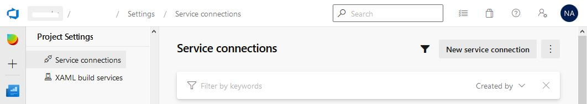
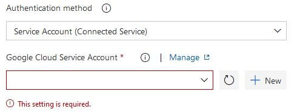
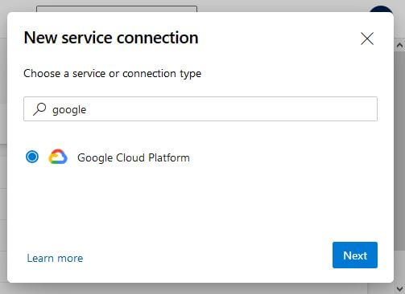
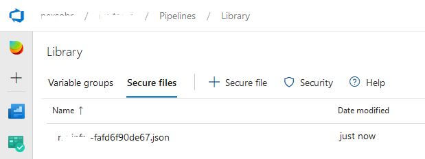
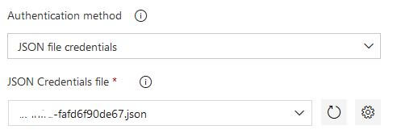

# Configure Azure DevOps Service Connection to Google Cloud

## 1. Create service account in GCP to use in Azure DevOps Pipelines
Go to the **IAM and Admin > Service Accounts** page in the GCP console menu <a href="https://console.cloud.google.com/iam-admin/serviceaccounts" target="_blank">or click here</a>, and create a new service account to use in Azure DevOps Pipelines (recommended). Enter a service account name (friendly display name), an optional description, and id (e-mail) and click in `Create`.  
Select a role you wish to grant to the service account, and then click `Save`.
You can find the necessary roles in the documentation of each task. You can access the docs in the README of the extension [(see here)](https://github.com/nexsolab/azure-devops-google-cloud-tools/#tasks).  
[Learn more about service accounts in the Google Cloud documentation](https://cloud.google.com/iam/docs/creating-managing-service-accounts)

## 2. Generate the service account key
On the *Service Accounts* page, find the row of the service account that you want to create a key for. In that row, click the More (3 dots) button, and then click `Create key`.  
In the popup select **JSON** key type and download the file.  
[You can learn more on how to create keys in the Google Cloud documentation](https://cloud.google.com/iam/docs/creating-managing-service-account-keys#creating_service_account_keys)

## 3. Copy JSON file key
Open the downloaded JSON file in a text editor.  
Copy the entire contents of the file.

## 4. Configure Google Cloud Tools extension
Go to the **Service connection** page in the Azure DevOps Project settings menu. (_The URL may be like: `https://dev.azure.com/[organization]/[project]/_settings/adminservices`_).  

> You can also click on the `Manage` link in a Google Cloud task:
> 

Search for `google` and click `Next`.  
Fill the `Json Text` field with content copied from the JSON key file and name the new service connection. This name is the label that will appear in the pipeline pick list.

[Learn more about service connections in Microsoft docs](https://docs.microsoft.com/en-us/azure/devops/pipelines/library/service-endpoints?view=azure-devops&tabs=yaml)

## 5. Use in a pipeline
Create a new build pipeline. Add a Google Cloud task, such as Google Cloud Functions.  
Under `Google Cloud Service Account` select the account you created.  
Fill in other required fields and queue a new build.

---

## Using uploaded JSON key file
You can also upload the JSON key file to the **Secure files** tab on the Library page (submenu of Pipeline menu).
(_The URL may be like: `https://dev.azure.com/[organization]/[project]/_library?itemType=SecureFiles`_).  
Click on `+ Secure file` button and send the JSON file retrieved from the Google Cloud Console.

In the pipeline, choose **JSON file credentials** in the `Authentication method` field and then the file name in `JSON Credentials file`.

