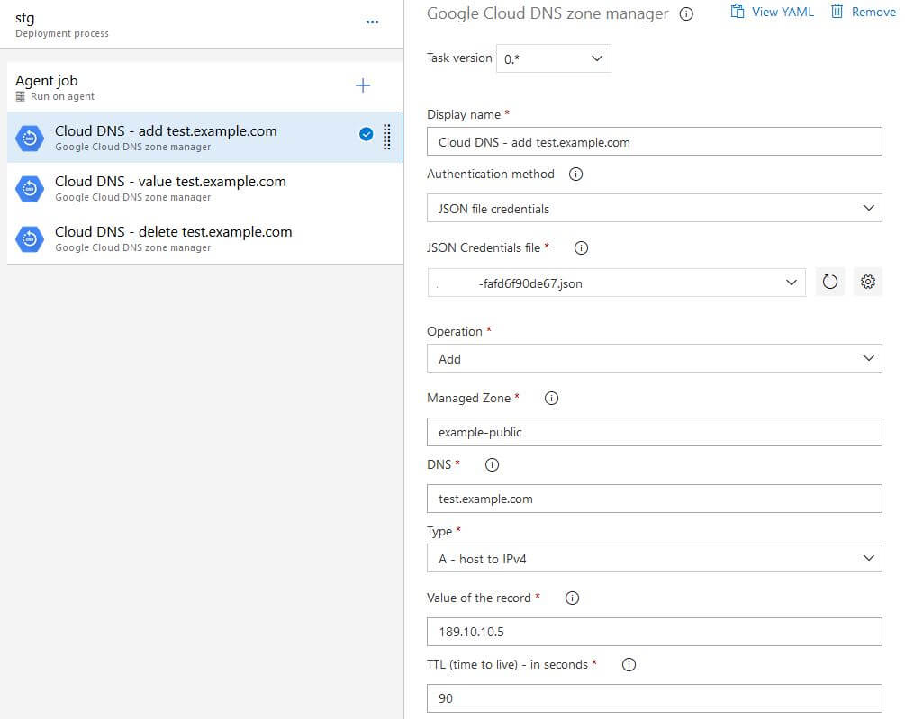
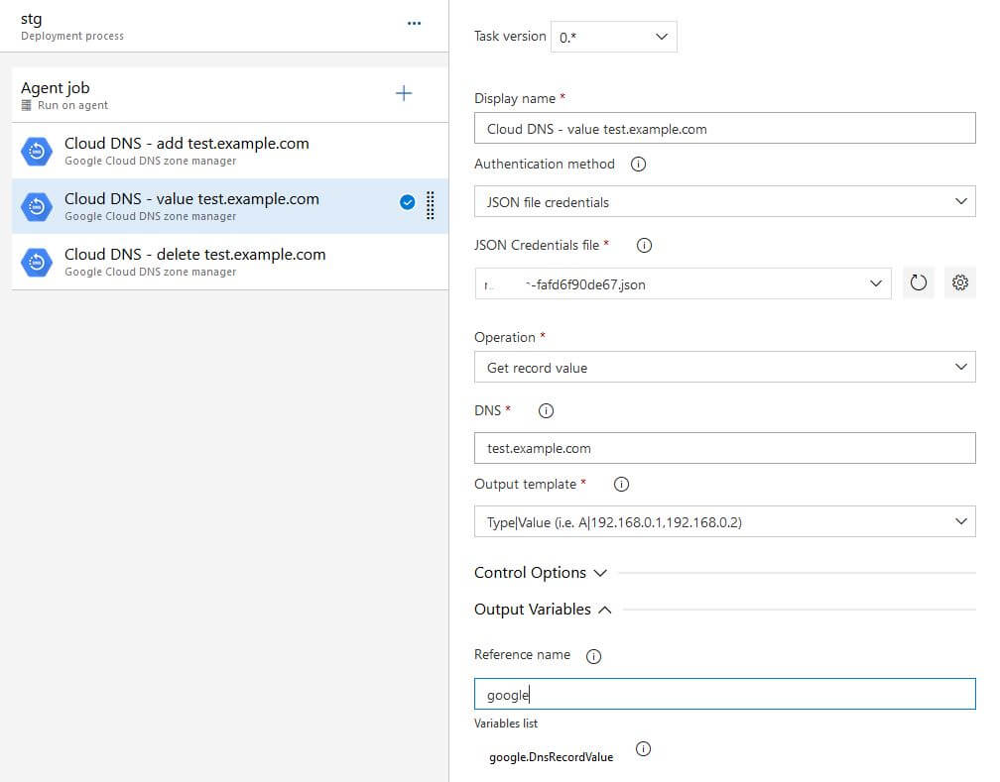

 

#  Google Cloud DNS

Manage Cloud DNS records via Azure DevOps Pipeline task.  
*Note: You don't need the Cloud SDK tool before this task.*

## Extension

Make sure you have the extension installed for your organization.  
See [How to install](/#how-to-install-extension) for more instructions.

## How to use

1. On your Release Pipeline add a new task and search for "Google Cloud DNS".  
2. Choose the operation:
    - **Add**  
Add a new record set to the existing managed zone.
    - **Delete**  
Delete the record set from the managed zone.
    - **Get the record value**  
Get the current record value and export it as an environment variable (`DnsRecordValue`).

## Authorization

The account informed in Service Connection or JSON key requires the following Google IAM permission on the specified resources (grouped by operation type):
- Create/Update
  - `ndev.clouddns.readwrite`
- Delete
  - `ndev.clouddns.readwrite`
- Get record value
  - `ndev.clouddns.readonly`

Or you can use the role:  
`roles/dns.admin`

## Operations

### Add

### Get the record value

### Delete

