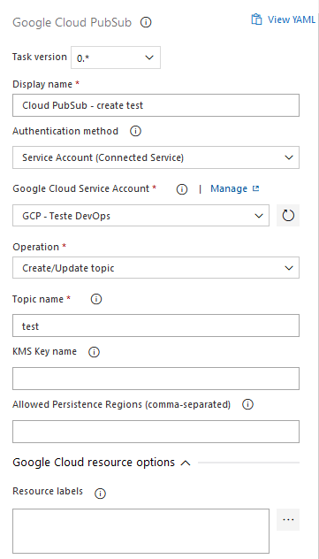
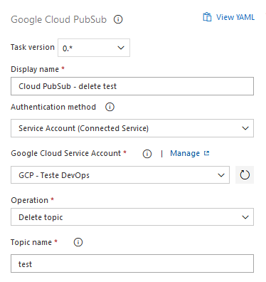
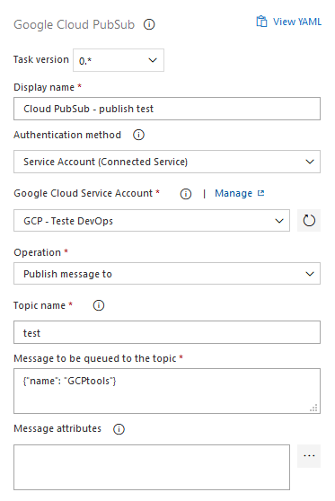
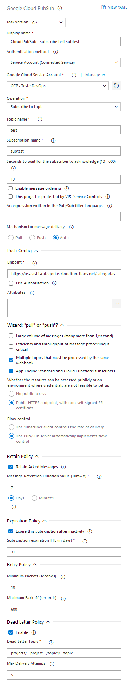
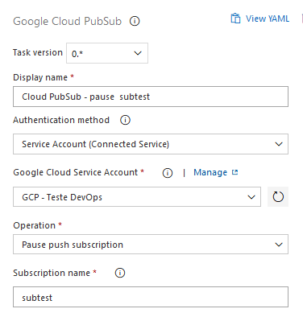
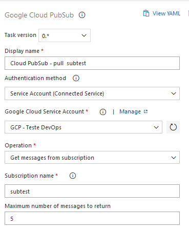
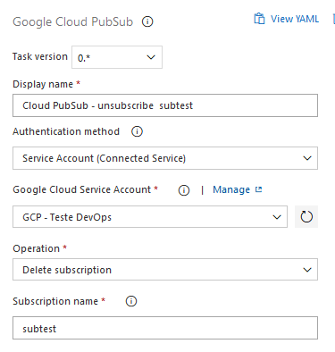

#  Google Cloud PubSub

Manage PubSub topics, subscriptions and messages.

## Extension

Make sure you have the extension installed for your organization.  
See [How to install](/#how-to-install-extension) for more instructions.

## How to use

1. On your Release Pipeline add a new task and search for "Google Cloud PubSub".  
2. Choose the operation and fill the required fields.

## Operations

### Topic

- **Create/Update topic**  
  Create a new Cloud PubSub topic or update config from existing one.
- **Delete topic**  
  Delete the resource for your project.
- **Publish messages to a topic**  
  Send a new message to a topic.

All operations export `PubSubTopic` output variable as the full resource name of the topic, in the format: `projects/{project_id}/topics/{topic_name}`.

### Subscription

- **Create subscription**  
  Listen to new messages in a topic.
- **Delete subscription**  
  You will not receive any new messages published to the topic.
- **Pause a push subscription**  
  Pause a push subscription, so new messages on the topic will not trigger endpoint.  
  For resume, you should use _Create subscription_ task to set push config again.
- **Get messages from subscription**  
  Get _n_ messages from a topic and export as JSON in a environment variable.

All operations export `SubscriptionName` output variable as the full resource name of the subscription, in the format: `projects/{project_id}/subscriptions/{subscription_name}`.

## Authorization

The account informed in Service Connection or JSON key requires the following Google IAM permission on the specified resources (grouped by operation type):

- Create/Update topic
  - `pubsub.topics.get`
  - `pubsub.topics.create`
  - `pubsub.topics.update`
- Delete topic
  - `pubsub.topics.delete`
- Publish messages to a topic
  - `pubsub.topics.publish`
- Create subscription
  - `pubsub.subscriptions.get`
  - `pubsub.subscriptions.create`
  - `pubsub.subscriptions.update`
  - `pubsub.topics.attachSubscription`  
   _Note that for creating a subscription in Project A to a Topic T in Project B, the appropriate permissions must be granted on both Project A and on Topic T. In this case, user identity info can be captured in Project B's audit logs._
- Delete subscription
  - `pubsub.subscriptions.delete`
- Pause a push subscription
  - `pubsub.subscriptions.update`
- Get messages from subscription
  - `pubsub.subscriptions.consume`

Or you can use the role:  
`roles/pubsub.editor`

## Screenshots

### Topics

#### Create

#### Delete

#### Publish message

### Subscriptions

#### Create/Update subscription

#### Pause a pull subscription

#### Get messages from topic

#### Delete the subscription

